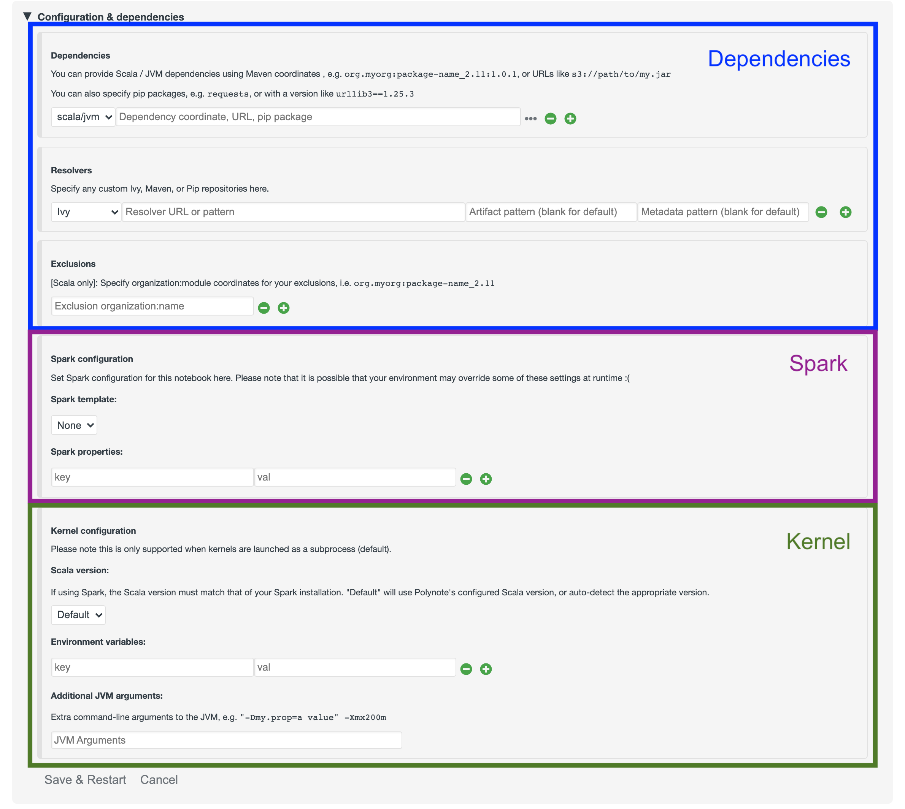

The Notebook Configuration section allows you to set metadata for this notebook's execution environment. 

The environment can be broken up into three general categories, as shown in the following diagram: 

- [Dependencies](#dependencies){: style="color: blue"}: the JVM and Python dependencies needed by your code
- [Spark Properties](#Spark){: style="color: purple"}: Spark-specific configuration
- [Kernel Configuration](#kernel){: style="color: green"}: other runtime configuration for the Kernel

### Dependencies

This section provides options for configuring dependencies that should be available when the notebook is executed.

#### JVM dependencies

JVM dependencies can be specified in the familiar 
[Group, Artifact, Version (or GAV) notation](https://maven.apache.org/guides/mini/guide-naming-conventions.html), such
as `org.http4s:http4s-core:1.0.0-M16`. 

Polynote will resolve and download this dependency, as well as its transitive dependencies, using 
[Coursier](https://get-coursier.io/). Use the Exclusions section to exclude any pesky transitive dependencies that are
causing you problems.

Use the Resolvers section to set up any custom resolvers (e.g., your company's internal resolver). Polynote supports 
both Maven and Ivy resolvers (the type of resolver can be selected in the dropdown).

Additionally, Polynote supports specifying a URL directly to a jar file - such as `file:///home/jars/myCoolLibrary.jar`. 
Supported schemas include `http` and `s3` (if Spark is enabled). 

!!!warning
    Note that if you specify a jar directly, Polynote will not resolve any transitive dependencies for this jar. In 
    general, we recommend using GAV coordinates if you can.

#### Python dependencies

Similarly, Polynote allows you to specify Python dependencies using [anything supported by pip](https://pip.pypa.io/en/stable/user_guide/#installing-packages)

This means that you can specify pip dependencies by simply naming them, (e.g., `requests`), using a version 
(`requests==2.25.1`), and even a requirement specifier (`requests>=2.25`). You can also pass in a file URL, as long as
it's supported by pip. 

You can also specify additional pip resolvers (e.g., your company's internal resolver) in the Resolvers section (select
`pip` in the dropdown). Polynote just passes the resolver into pip (using 
[`--extra-index-url`](https://pip.pypa.io/en/stable/reference/pip_install/#install-extra-index-url)), so be sure your
repository URL works with that. 

Polynote creates a virtual environment for your notebook when you specify any pip dependencies. See the [python 
documentation](python.md#python-dependencies) for more details. 

#### Dependency Caching

By default, Polynote caches JVM dependencies that are specified with URLs, as well as the [virtual environment created
for your notebook](python.md#python-dependencies). 

You can choose to manually bust the cache by unfolding the Advanced Options pane for your dependency by clicking on the 
`...` button next to it. 

### Spark

### Kernel